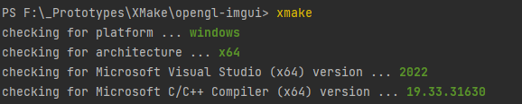
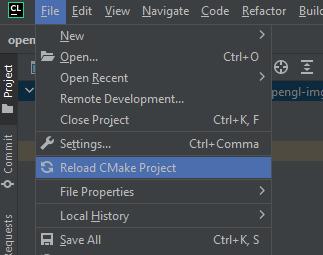
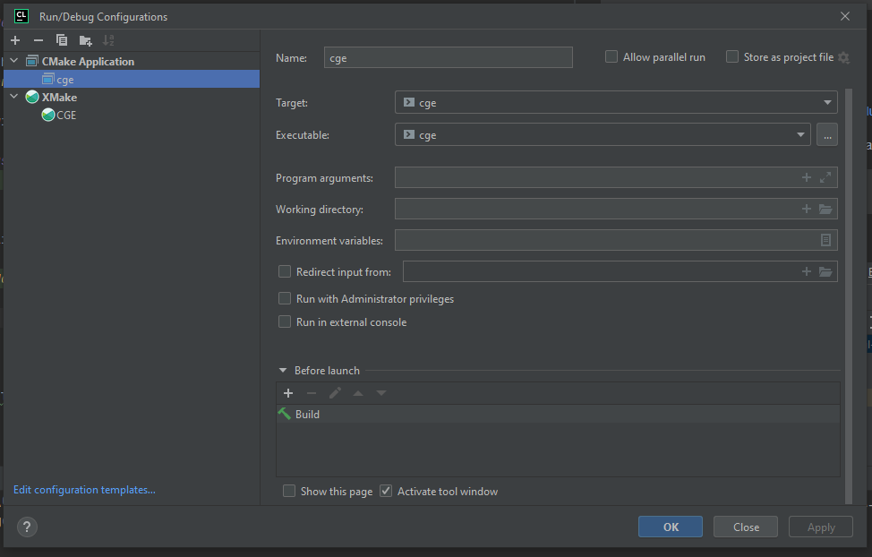

## State 

[](docs/current_progress_2022_11_12.mp4)

### Installation / Instalare

Install [XMake](https://xmake.io/#/guide/installation). Make sure to have [MSVC compiler for x64 set in the Console](https://learn.microsoft.com/en-us/cpp/build/building-on-the-command-line?view=msvc-170).

Copy shaders and assets to build file:

In the root folder. Run:

```bash
xmake
```

It will make a platform checking, you should see something like this:



:warning: The toolchain is SET for MSVC! XMake will download the dependency and compile it to the compiler showed in console. If in the console show another compiler like MinGW, then you run the build with MSVC, you will have errors.

Black Magic for setting the platform to x64 and generate `CMakeLists.txt` for VS or Clion.

```bash
xmake f -y -p windows -a x64 -m release
xmake project -k cmake -y
```

```bash
cp shaders/* assets/* build/windows/x64/release/Debug/ && cp shaders/* assets/* build/windows/x64/release/
```


After the building is done, run:

```bash
xmake run
```

You should see the window of the program.


### Developing

For this project, CLion is used with the [XMake plugin](https://plugins.jetbrains.com/plugin/10156-xmake).

You will need to update CMakeList.txt using XMake. Run:

```bash
xmake project -k cmake -y
```

In Clion, reload the CMake:



The make a default Cmake configuration:



Then you can press the `Run` button which will run the project.

:warning: Since we are using Xmake, Clion does not know much about it, it only analyzes the Cmake file. So, when make a new file, we need to fresh the Cmake file using Xmake command from previous instruction.

It is a bit unconformable, but it is better than writing Cmake by hand or manual compiling and linking our dependency. Xmake does all of this for us, but IDE don't know how cool it is.


Instaleaza [XMake](https://xmake.io/#/guide/installation)